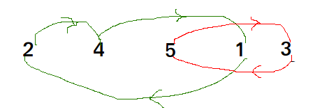

# Minimum number of swaps required to sort an array

Given an array of $n$ distinct elements, find the minimum number of swaps required to sort the array.

Examples

```
Input : {4, 3, 2, 1}
Output : 2
Explanation : Swap index 0 with 3 and 1 with 2 to 
              form the sorted array {1, 2, 3, 4}.

Input : {1, 5, 4, 3, 2}
Output : 2
```

This can be easily done by visualizing the problem as a graph. We will have $n$ nodes and an edge directed from node $i$ to node $j$ if the element at $i$’th index must be present at $j$’th index in the sorted array.

Graph for {4, 3, 2, 1}


The graph will now contain many non-intersecting cycles. Now a cycle with 2 nodes will only require 1 swap to reach the correct ordering, similarly a cycle with 3 nodes will only require 2 swap to do so.

Graph for {4, 5, 2, 1, 5}



Hence,
- $ans = \sum_{i = 1}^{k} (CycleSize - 1)$ 

where $k$ is the number of cycles

**Time Complexity**: $O(n log n)$

**Auxiliary Space**: $O(n)$

[**Reference**](https://stackoverflow.com/questions/20990127/sorting-a-sequence-by-swapping-adjacent-elements-using-minimum-swaps)